## 运行

### ProTable 封装可以参考
### https://github.com/TopAlien/base-admin-naive
### https://github.com/TopAlien/vue3-admin-cli
### https://procomponents.ant.design/components/table 

### 1、yarn install

### 2、yarn dev

## 构建

### 1、build:dev 打包开发环境

### 2、build:test 打包测试环境

### 3、build:prod 打包正式环境

... 自定义可以增加 .env.[mode]
... package.json scripts 对应 --mode [mode]

### 功能/技术栈

- vue@3
- pinia
- vite@5
- less css预处理器, 变量
- 请求使用原生支持的fetch（vueuse/useFetch hook）useFetch二次封装, 不再使用axios
- vue-router@4
- unocss - safelist加载动态icon class
- vueuse
- ant-design-vue@4.x - zh-cn 组件二次封装slot, attrs透传
- smooth-scrollbar自定义滚动条（自定义指令)
- 可配置右侧content接口请加载动画（如图7），见service/index.js showLoading配置
- 图表库 Echarts-v5
- 图表库 G2-5.0
- 简单易用的打印，局部打印 hiprint，直接预览，导出pdf
- lodash-es版 方便vite tree shake, 减少包体积；所以我们在选择第三方库时，要尽可能使用 ESM 版本，可以提升不少性能！
- 切换页面回到顶部，区域滚动router无效
- Org Tree
- Calendar 日历
- idcard 校验身份证[第二代]合法性，获取身份证详细信息（可15位转18位）
- NProgress 页面切换进度条
- 后端动态路由匹配 config 开启后查看示例, 权限更新后刷新即可，无需重新登录
- 基于Modal封装useModal函数式调用
- 浏览器唯一标识，用于游客记录等
- json美化预览/编辑
- 按钮 v-loading（loading动画）自定义指令 - 节流
- 按钮级权限指令 v-auth.[moduleName]
- 关键词高亮组件TextMark组件
- 文本溢出显示...组件
- 数据使用[Apifox云端Mock](https://apifox.com/help/api-mock/cloud-mock)
- Tabs反圆角
- Table区域滚动（自动计算）
- 图片懒加载指令

### import.meta.env 访问环境变量，自定义 VITE\_ 开头

### 项目部分截图

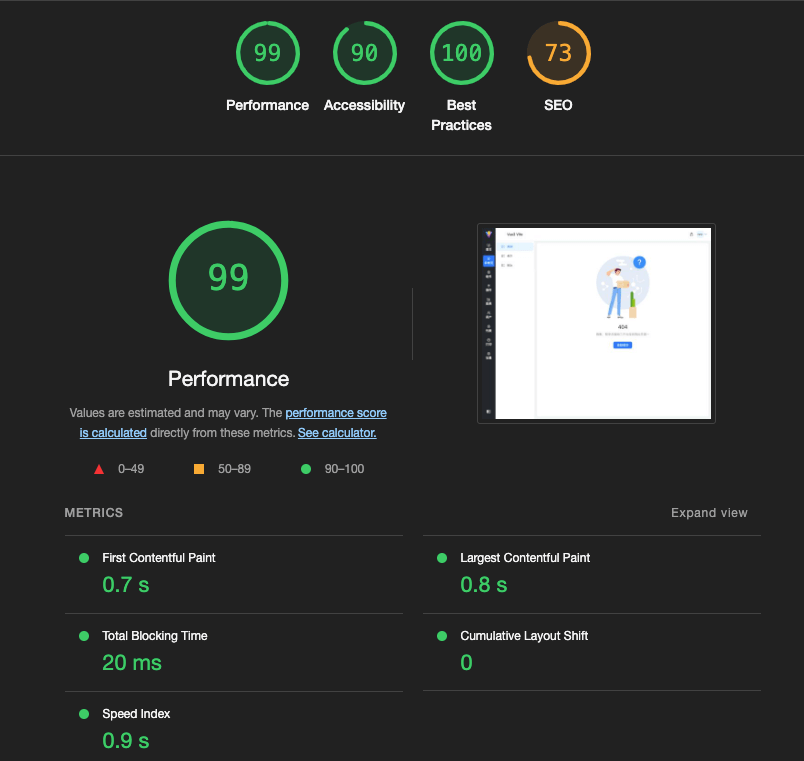
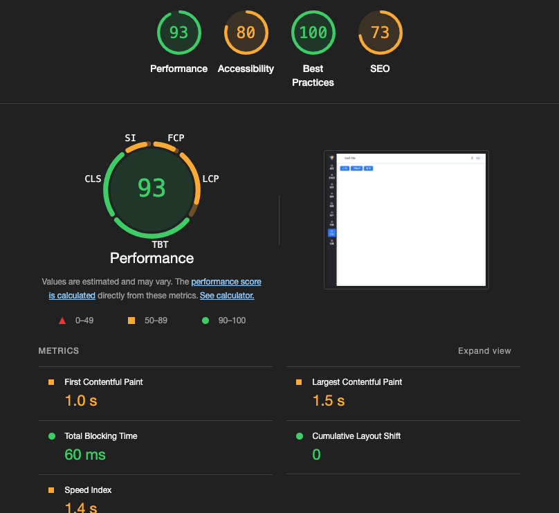
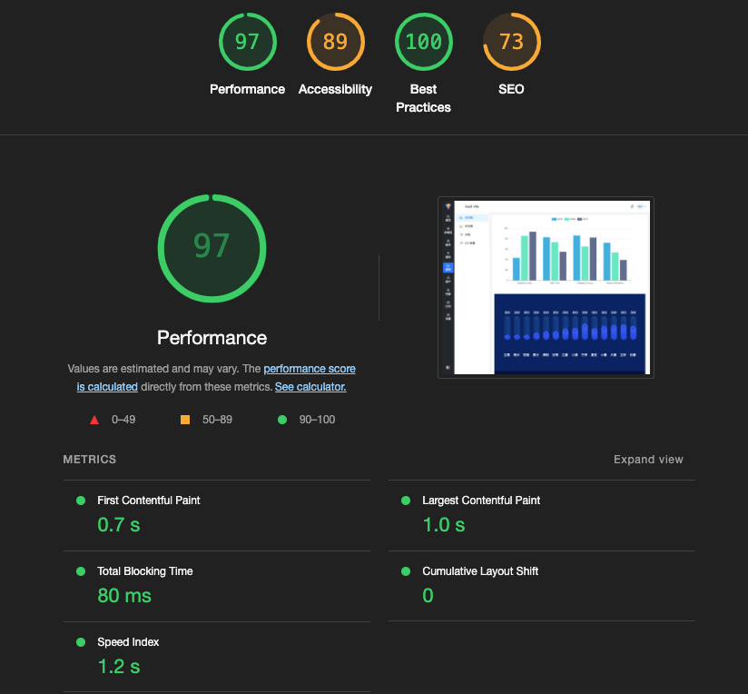
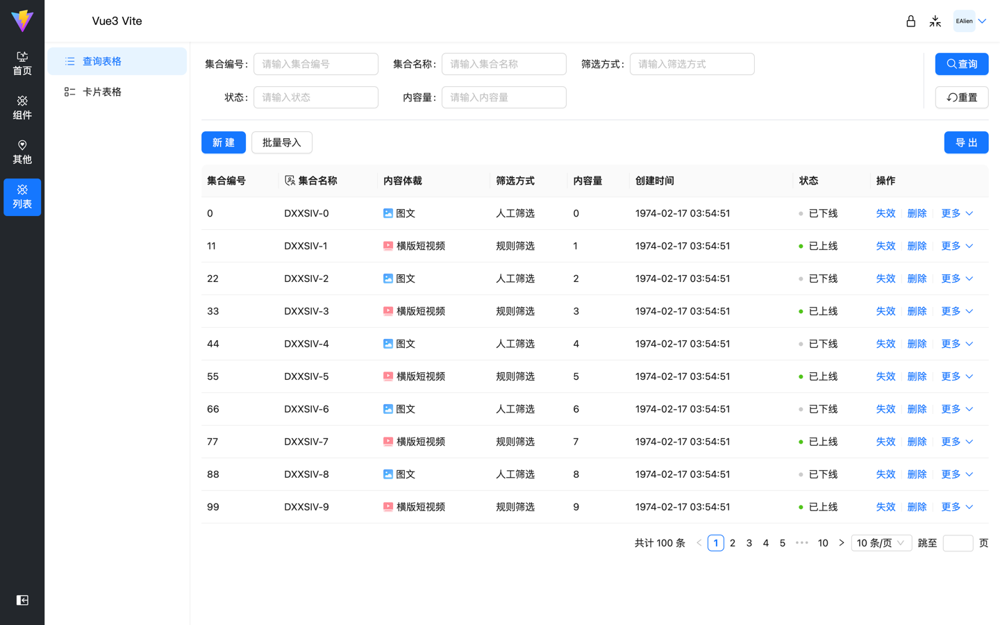
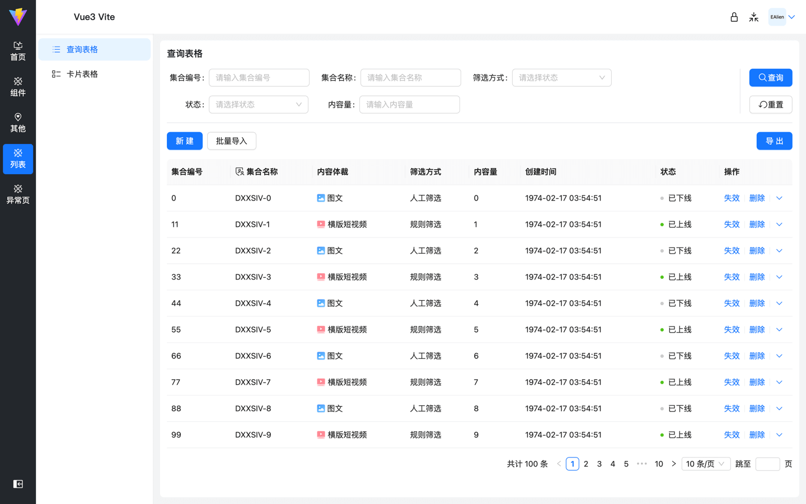
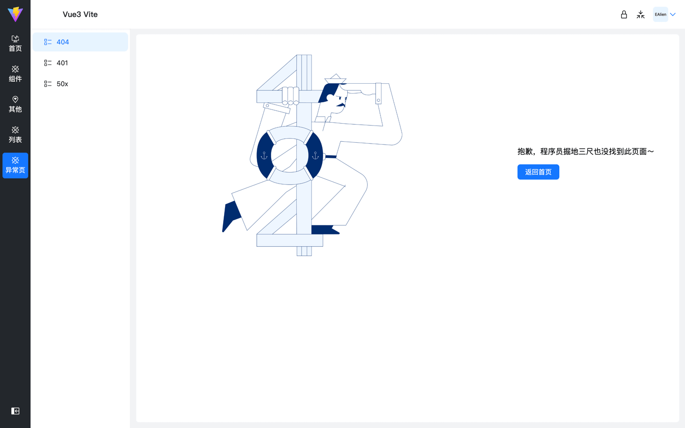
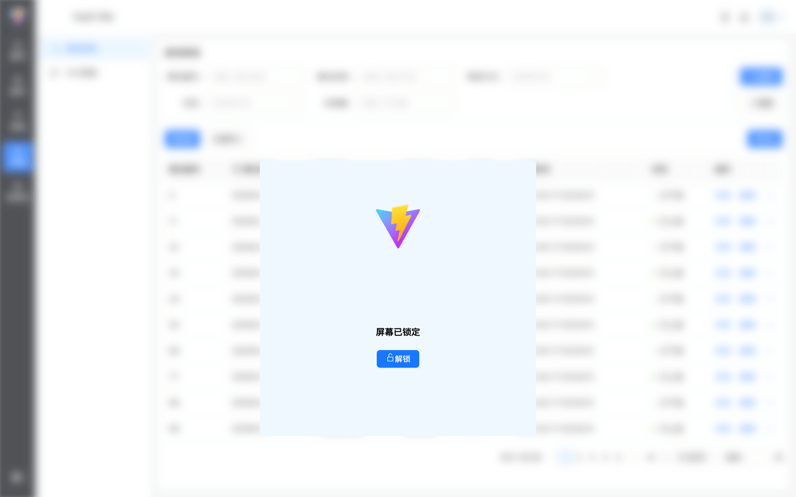
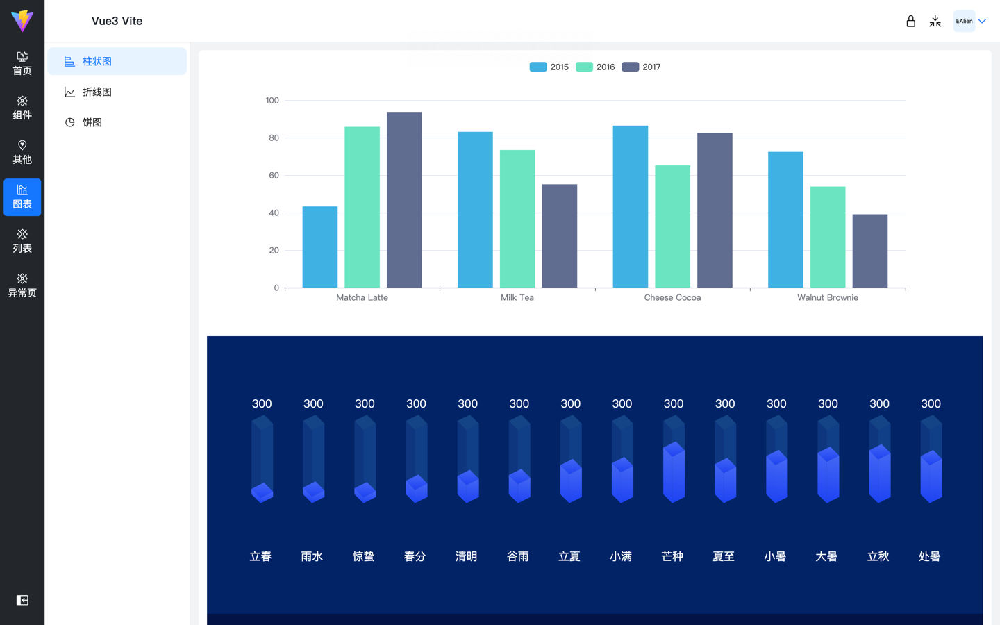
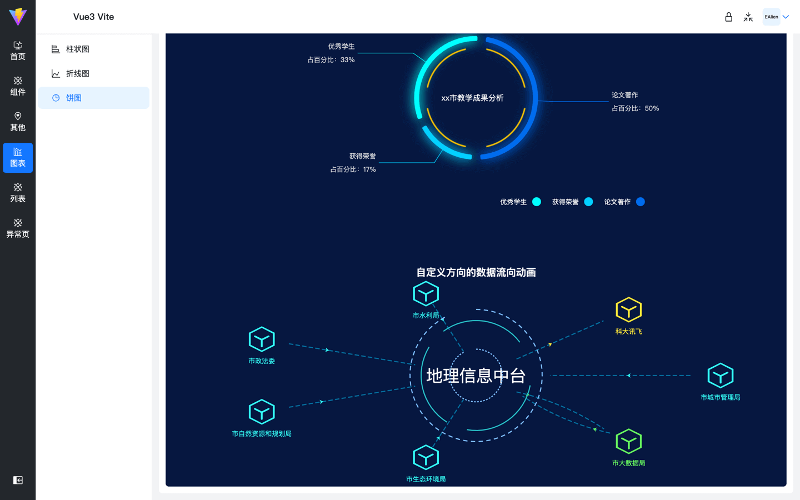

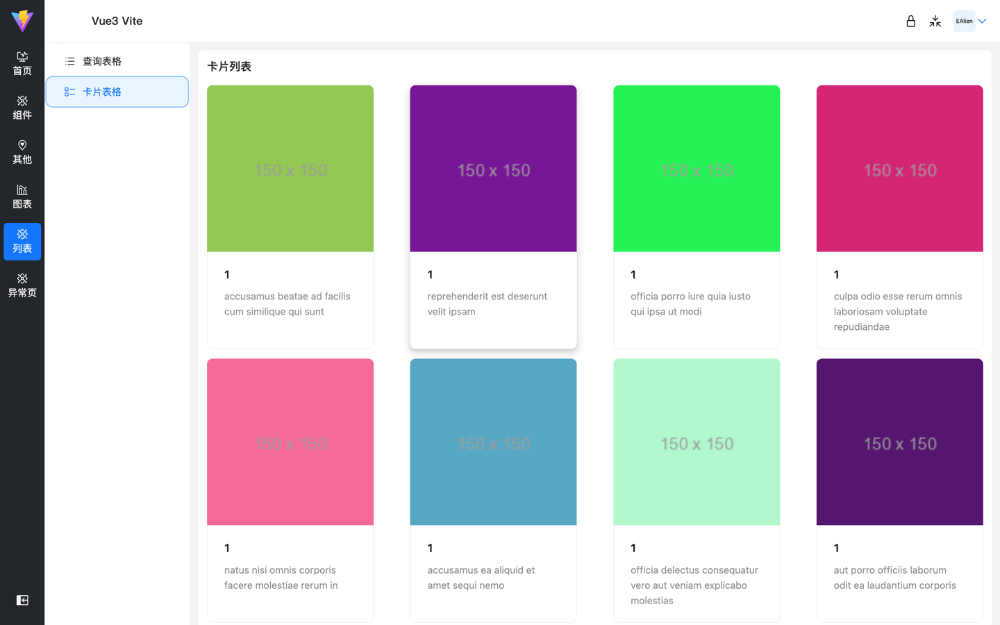
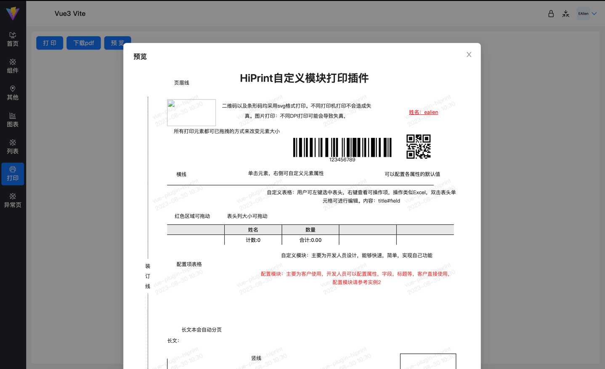
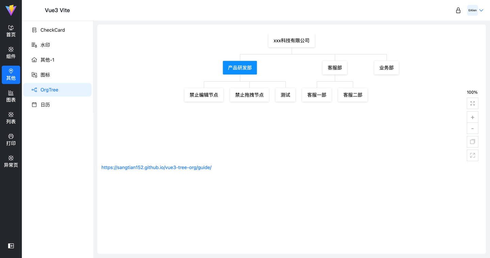
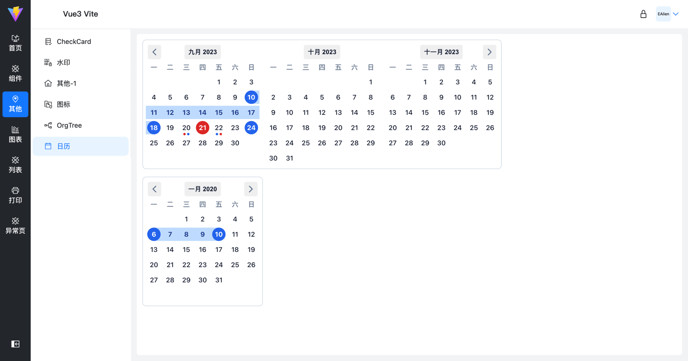
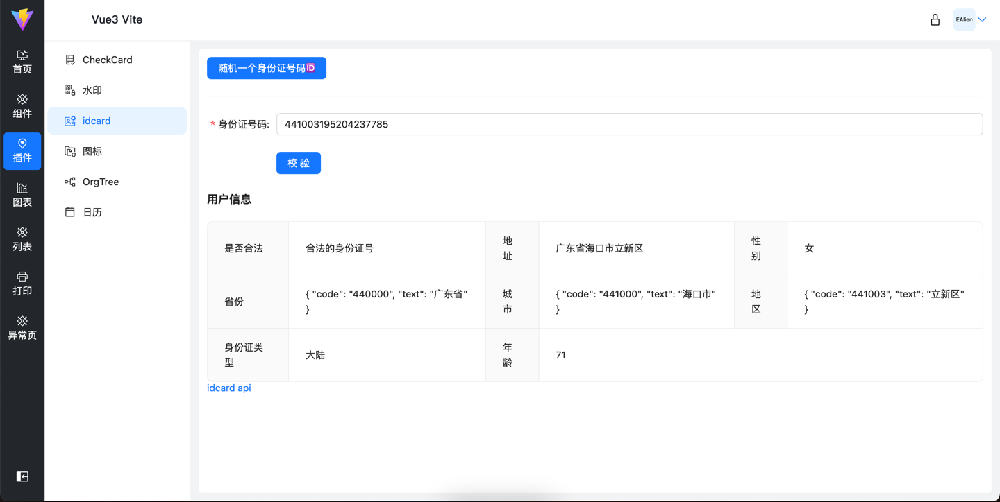
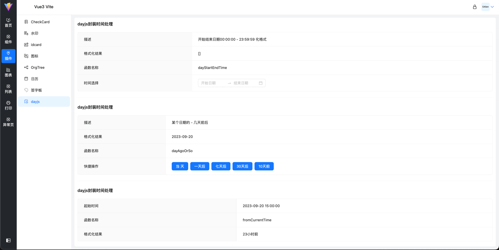
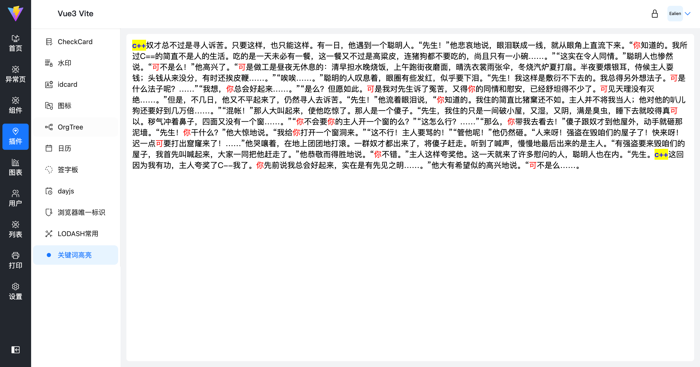

### 路由配置

```js
const BASE_URL = '/other'[
  {
    // path必须写完整的路径，要做跳转匹配
    path: BASE_URL,
    component: Layout,
    name: 'Com',
    redirect: `${BASE_URL}/list-1/list2-1`, // 不再需要，自动重定向第一个
    // icon 为carbon时在，safelist中添加class
    // meta: { icon, hideInMenu, title }
    meta: {
      title: '组件',
      // 需要显示到column tab中的分组
      isGroup: true,
      icon: 'i-carbon-ibm-cloud-transit-gateway'
    },
    children: [
      {
        path: `${BASE_URL}/list-1`,
        redirect: `${BASE_URL}/list-1/list2-1`,
        name: 'List-1',
        meta: {
          title: '列表-1',
          icon: 'i-carbon-list-boxes'
        }
      }
    ]
  }
]
```

## 真香👍

### [图表来自](http://ppchart.com/#/)

### [插画](https://undraw.co/illustrations)

### [404插画](https://error404.fun/)

### [打印](https://www.npmjs.com/package/vue-plugin-hiprint)

### [数据mock-Apifox](https://apifox.com/)

## 开发经验/优化

1. 避免整体监听对象，会隐式触发deep。分清楚watch({}), 和 watch(() => {}) 使用场景

```js
const watState = reactive({ arr: [], count: 1, str: '123', bo: true })

// watch(watState.str, () => {})
// 原始值不能直接监听，需要用getter函数
// 引用可以直接监听，会隐式创建deep，用到getter函数，需显示deep监听，否则需要整体替换才触发watch 例： watState.arr = []
watch(
  () => watState.arr,
  (newVal, oldVal) => {
    message.success('触发！')
    console.log('-> newVal, oldVal', newVal, oldVal)
  }
)

const onWatch = () => {
  watState.arr = [{ name: 'ealien', age: '123', sex: '1' }]
}

const counter = ref(0)
// 不是原始值不能直接监听吗？啊这...。 别忘了ref访问需要 .value呀。souga
watch(counter, (newVal, oldVal) => {
  console.log('-> newVal, oldVal', newVal, oldVal)
})
```

2. 子组件想知道emit父级到底传没传？

```vue
<!-- 1、父组件 -->
<ModalFooter @confirm="() => {}" />

<!-- 2、ModalFooter 组件 -->
const emit = defineEmits(['confirm', 'cancel'])

<!-- props 在emit前面加on 嘎嘎好使 -->
const props = defineProps({ onConfirm: { type: Function }, onCancel: { type: Function }, })

<!-- 这不就来了嘛，这里直接用来判断就完事了 -->
props.onConfirm props.onCancel
```

## 指令

1. v-loading

```js
const loading = `<span class="ant-btn-loading-icon"><span role="img" aria-label="loading" class="anticon anticon-loading anticon-spin"><svg focusable="false" data-icon="loading" width="1em" height="1em" fill="currentColor" aria-hidden="true" viewBox="0 0 1024 1024"><path d="M988 548c-19.9 0-36-16.1-36-36 0-59.4-11.6-117-34.6-171.3a440.45 440.45 0 00-94.3-139.9 437.71 437.71 0 00-139.9-94.3C629 83.6 571.4 72 512 72c-19.9 0-36-16.1-36-36s16.1-36 36-36c69.1 0 136.2 13.5 199.3 40.3C772.3 66 827 103 874 150c47 47 83.9 101.8 109.7 162.7 26.7 63.1 40.2 130.2 40.2 199.3.1 19.9-16 36-35.9 36z"></path></svg><!----></span></span>`

/**
 * 通过自定义样式(global.less)，对 primary 类型按钮，和官方示例一样。事件只执行一次
 *
 * 默认值1500毫秒
 * v-loading="2000"
 * v-loading == v-loading="1500"
 */
export default {
  mounted(el, binding) {
    const originInnerHtml = el.innerHTML

    if (binding.value && typeof binding.value !== 'number') {
      console.error('自定义时间应为数字 例： v-loading="2000"')
      return
    }

    el.addEventListener(
      'click',
      () => {
        if (!el.disabled) {
          el.disabled = true
          el.innerHTML = `${loading}${originInnerHtml}`

          setTimeout(() => {
            el.innerHTML = originInnerHtml
            el.disabled = false
          }, binding.value || 1500)
        }
      },
      false
    )
  }
}
```

2. v-auth 按钮权限指令

```js
/**
 * 设计场景
 *
 * 1、后台新增权限时选择类型是否是按钮，选择按钮类型。登录后调取接口查出所有按钮类型权限：(我使用接口作为唯一标识)
 * response = ['/user/list', '/user/add', '/user/detail/add', '/user/detail/edit']
 *
 * 指令使用格式
 * v-auth="'/user/list'"
 * v-auth="['/user/list', '/user/detail/edit']"
 *
 *
 * 2、按照菜单权限层级返回。类似 mock 中的 adminRoutes，再增加类型区分是否是按钮权限即可。
 * response = [{ key: 'user', children: [{ key: 'user/list', children: [{ type: 'btn', key: 'api/user/list' }] }] }]
 *
 * 使用（.[user]修饰符用来快速定位查找，也可以起到命名空间的作用）
 *
 * 找到命名空间内的
 * v-auth.user="'api/user/list'"
 * v-auth.user="['api/user/list', 'api/user/list']"
 * v-auth="{ user: ["api/user/list", "api/user/add"], setting: [""] }"
 * v-auth="{ user: "", setting: "" }"
 *
 * user和setting模块中任意找到
 * v-auth.user.setting="api/user/list"
 * v-auth.user.setting="['api/user/list', 'api/user/add']"
 *
 * tip：要是有 user下面，或者setting下面有某个权限都可以显示按钮这种场景该怎么办
 *
 * <button v-auth="{ user: "", setting: "" }"></button>
 * <button v-auth="{ user: ["api/user/list", "api/user/add"], setting: [""] }"></button>
 */

import { isArray, isString, isPlainObject } from 'lodash-es'

const _mockResRouteData = [
  {
    key: 'user',
    name: '用户管理',
    children: [
      {
        key: 'user/list',
        name: '用户列表',
        children: [
          { type: 'btn', key: 'api/user/list', name: '用户列表查看' },
          { type: 'btn', key: 'api/user/detail', name: '用户详情' },
          { type: 'btn', key: 'api/user/auth-edit', name: '用户权限编辑' }
        ]
      },
      {
        key: 'user/list1',
        name: '用户列表1',
        children: [
          { type: 'btn', key: 'api/user/list1', name: '用户列表查看1' },
          { type: 'btn', key: 'api/user/detail1', name: '用户详情1' },
          { type: 'btn', key: 'api/user/auth-edit1', name: '用户权限编辑1' }
        ]
      }
    ]
  },
  {
    key: 'setting',
    name: '设置',
    children: [
      {
        key: 'setting/auth',
        name: '权限设置',
        children: [
          { type: 'btn', key: 'api/auth/add', name: '新增权限' },
          { type: 'btn', key: 'api/auth/edit', name: '编辑权限' },
          { type: 'btn', key: 'api/auth/list', name: '权限列表' }
        ]
      }
    ]
  },
  {
    key: '404',
    name: '异常页面',
    children: [
      {
        key: 'exception/404',
        name: '404页面',
        children: [
          { type: 'btn', key: 'api/exception/add', name: '新增' },
          { type: 'btn', key: 'api/exception/edit', name: '编辑' }
        ]
      },
      {
        key: 'exception/503',
        name: '503页面'
      }
    ]
  }
]

// 模块唯一标识key
const KEY_NAME = 'key'
const findNamesRoutes = (moduleName) => {
  return (_mockResRouteData.find((route) => route[KEY_NAME] === moduleName) || {}).children || []
}

const btnKeys = (routes) => {
  const keys = []

  function find(arr) {
    arr.forEach((it) => {
      // 按钮类型的唯一key
      if (it.type === 'btn') {
        keys.push(it[KEY_NAME])
      }

      if (it.children && it.children.length) {
        find(it.children)
      }
    })
  }

  find(routes)

  return keys
}

/**
 * 比对是否有相同项，只要找到一个有相同的，就立即返回（或的关系，所以可以提前返回）
 *
 * arrModuleValue 必然存在
 */
const hasDuplicates = (arr1, arrModuleValue) => {
  for (let i = 0, len = arrModuleValue.length; i < len; i++) {
    if (arr1.includes(arrModuleValue[i])) {
      return true
    }
  }

  return false
}

const hasPer = (moduleName, moduleValue) => {
  const keys = btnKeys(findNamesRoutes(moduleName))

  if (isString(moduleValue)) {
    return keys.includes(moduleValue)
  }

  if (isArray(moduleValue) && moduleValue.length > 0) {
    return hasDuplicates(keys, moduleValue)
  }

  return false
}

const DOM_MARK = 'data-auth'
const hasMark = (el) => {
  return el.getAttribute(DOM_MARK) === 'true'
}

const setMark = (el) => {
  el.setAttribute(DOM_MARK, true)
}

const removeEl = (el) => {
  el && el.parentNode && el.parentNode.removeChild(el)
}

/**
 * 场景2方式实现
 */
export default {
  mounted(el, binding) {
    const { modifiers, value } = binding

    const valueIsPlainObj = isPlainObject(value)
    const routeModules = Object.keys(valueIsPlainObj ? value : modifiers)

    if (routeModules.length) {
      try {
        routeModules.forEach((module) => {
          const curModuleValue = valueIsPlainObj ? value[module] : value
          if (hasPer(module, curModuleValue)) {
            setMark(el)
            throw new Error('当前el已打标可立即跳出')
          }
        })
      } catch {}
    } else {
      // 没有命名空间直接删除，例：v-auth='"api/list"'
      removeEl(el)
      return
    }

    if (!hasMark(el)) {
      removeEl(el)
    }
  },

  updated() {},

  unmounted() {}
}
```

3. v-scrollbar 自定义scrollbar样式，类似mac滚动条

```js
import Scrollbar from 'smooth-scrollbar'
import config from '@/config/index.js'

const extractProp = (prop) => (obj) => (typeof obj === 'undefined' ? undefined : obj[prop])
const extractOptions = extractProp('options')
const extractEl = extractProp('el')

const bestMatch = (extractor) => (possibilities) =>
  extractor(possibilities.find((p) => typeof extractor(p) !== 'undefined'))
const bestEl = bestMatch(extractEl)
const bestOptions = bestMatch(extractOptions)

/**
 v-scrollbar
 v-scrollbar="{ el: "" }"
 */
export default {
  mounted(el, binding) {
    if (config.useCustomScrollBar) {
      const possibilities = [binding.value]
      const targetEl = bestEl(possibilities)
      const config = bestOptions(possibilities)

      const scrollY = binding.modifiers.y
      const scrollX = binding.modifiers.x
      Scrollbar.init(targetEl ? document.querySelector(targetEl) : el)
    }
  },

  updated(el, binding, vnode, prevVnode) {},

  unmounted(el, binding) {
    if (config.useCustomScrollBar) {
      const possibilities = [binding.value]
      const targetEl = bestEl(possibilities)
      Scrollbar.destroy(targetEl ? document.querySelector(targetEl) : el, {})
    }
  }
}
```

4. v-lazyImg 图片懒加载

```
import { useIntersectionObserver } from '@vueuse/core'

/**
 v-lazyImg="'https://via.placeholder.com/250'"
 */
export default {
  mounted(el, binding) {
    const { stop } = useIntersectionObserver(
      el,
      ([{ isIntersecting }], observerElement) => {
        if (isIntersecting) {
          stop()

          el.src = binding.value
        }
      },
      { threshold: 0 }
    )
  }
}
```
