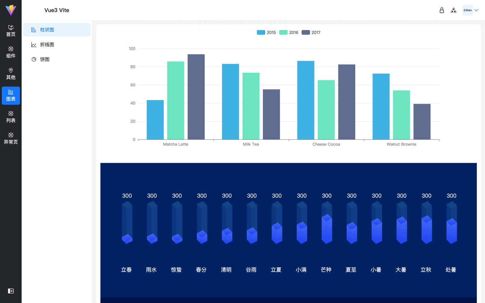

## 运行

### 1、yarn install

### 2、yarn dev

## 构建

### 1、build:dev 打包开发环境

### 2、build:test 打包测试环境

### 3、build:prod 打包正式环境

... 自定义可以增加 .env.[mode]
... package.json scripts 对应 --mode [mode]

### 技术栈

- less css预处理器, 变量
- pinia
- vite@4
- vue@3
- axios
- vue-router@4
- unocss - safelist加载动态icon class
- vueuse
- ant-design-vue@4.x - zh-cn 组件二次封装slot, attrs透传
- smooth-scrollbar自定义滚动条（自定义指令)
- 可配置右侧content接口请加载动画（如图7），见service/index.js showLoading配置
- 图表库 Echarts-v5
- 图表库 G2-5.0

### import.meta.env 访问环境变量，自定义 VITE\_ 开头

### 项目截图





### 路由配置

```js
const BASE_URL = '/other'

[
  {
    // path必须写完整的路径，要做跳转匹配
    path: BASE_URL,
    component: Layout,
    name: 'Com',
    redirect: `${BASE_URL}/list-1/list2-1`,
    // icon 为carbon时在，safelist中添加class
    // meta: { icon, hideInMenu, title }
    meta: {
      title: '组件',
      // 需要显示到column tab中的分组
      isGroup: true,
      icon: 'i-carbon-ibm-cloud-transit-gateway'
    },
    children: [
      {
        path: `${BASE_URL}/list-1`,
        redirect: `${BASE_URL}/list-1/list2-1`,
        name: 'List-1',
        meta: {
          title: '列表-1',
          icon: 'i-carbon-list-boxes'
        }
      }
    ]
  }
]
```

### 图表来自 http://ppchart.com/#/ 大赞👍

### 插画 https://undraw.co/illustrations

### 404插画 https://error404.fun/
